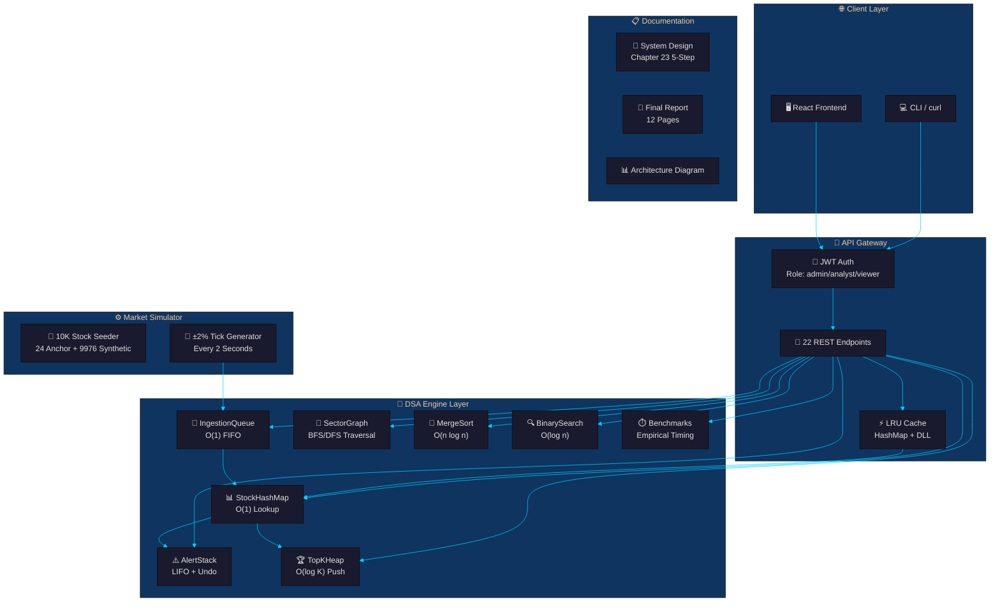

# Person 1 — Team Lead / Integrator

## Your Role
You are the **foundation builder**. You set up the repository structure, configuration files, launch scripts, and all project documentation. You ensure the rest of the team has a clean, organised starting point.

---

## Your Files

| File | Purpose |
|------|---------|
| `.gitignore` | Excludes Python caches, virtual envs, Node modules, OS files |
| `README.md` | Professional project README with API table, complexity matrix, run instructions |
| `vercel.json` | Vercel serverless deployment config |
| `start.bat` | Windows one-click launcher |
| `start.sh` | Linux/Mac one-click launcher |
| `requirements.txt` | Python dependencies (Flask, PyJWT, pytest, etc.) |
| `docs/system_design.md` | Chapter 23 five-step system design |
| `docs/final_report.md` | 12-page technical report |
| `docs/architecture.py` | Python script that generates `architecture.svg` |
| `docs/architecture.svg` | System architecture diagram |
| `docs/TEAM_WORKFLOW.md` | Git commit instructions for the team |

---

## Your Tasks

### 1. Create the Repo on GitHub

```bash
# Create a repo named: DSA-CH23-GROUP-XX (replace XX with your group number)
# Make it Public, NO README, NO .gitignore, NO license
# Then follow the instructions GitHub gives you
```

### 2. Clone and Push Initial Files

```bash
git clone https://github.com/jacksonvincent012-web/DSA-CH23-GROUP-XX.git
cd DSA-CH23-GROUP-XX
# Copy ALL files from this folder into the repo root
git add .gitignore README.md vercel.json start.bat start.sh requirements.txt docs/
git commit -m "Initial commit: project scaffold and documentation"
git push origin main
```

### 3. Add Your Team Members as Collaborators

On GitHub → Settings → Collaborators → Add people (their GitHub usernames or emails).

### 4. Document Architecture



The system has four layers:
- **Client Layer** — users interact via curl or a web frontend
- **API Gateway** — JWT authentication, route dispatch, and an LRU cache for hot stocks
- **DSA Engine** — 9 data structures connected in a pipeline
- **Simulator** — background thread that seeds 10,000 stocks and generates live price ticks

### 5. Write the 5-Step System Design

Open `docs/system_design.md`. It must contain:

**Step 1 — Use Cases:**
- User logs in with email/password → JWT issued
- User views a stock's current price by symbol (hash map lookup)
- User views top-K stocks by volume (heap)
- User sets a price alert (stack push)
- User explores sector relationships (graph BFS/DFS)
- User views sorted price history (merge sort + binary search)
- Simulator generates ticks → queue → map update

**Step 2 — Constraints:**
- 10,000 stocks, 90-day price history
- N = 10K for benchmarks
- 1,000 max alerts, K=10 for heap, capacity=50 for LRU cache
- Memory: ~50-100 MB (in-memory Phase 1)

**Step 3 — Basic Design:**
The architecture diagram above. Flask app, background thread simulator, JWT auth middleware, DSA engine instances attached to app context.

**Step 4 — Bottlenecks:** (see final report for full details)
- **B1:** Linear scan of 10K stocks for top-K → fixed with TopKHeap
- **B2:** list.pop(0) O(n) dequeue → fixed with deque O(1) popleft
- **B3:** Repeated hash computation on hot stocks → fixed with LRU Cache O(1)
- **B4:** Recursion depth on large graphs → fixed with iterative DFS
- **B5:** Benchmark stack overflow at 10K → capped at 500 per run

**Step 5 — Scalability Path:**
```
Phase 1 (current):  In-memory, single process
Phase 2 (planned):  PostgreSQL for persistence, Redis for caching
Phase 3 (planned):  Horizontal scaling with Kafka queue + worker pool
```

### 6. Write the Final Report

The 12-page `docs/final_report.md` is already written. Verify it covers:
- Introduction & team roles
- Step 1-5 from Chapter 23
- DSA structure deep-dives (one page each)
- Complexity analysis table
- Benchmark results
- API reference
- Testing summary
- Conclusion & future work

### 7. Submit on VLMS

- Share the **GitHub repo link** on VLMS
- Each team member submits the same link individually
- The commit history shows contributions from all 6 members

---

## Scalability Discussion

Our **Phase 1** is fully in-memory — fast but not durable. If the server restarts, all data is lost.

**Phase 2** would add:
- **PostgreSQL** for stock data, user accounts, and price history
- **Redis** for the LRU cache (production-grade, supports TTL)
- Session remains in JWT (already stateless)

**Phase 3** would add:
- **Apache Kafka** for tick ingestion (replaces IngestionQueue)
- **Kubernetes** for horizontal scaling of API servers
- **Read replicas** for the database

---

## Your Git Commands

```bash
# Stage your files
git add .gitignore README.md vercel.json start.bat start.sh requirements.txt docs/

# Commit
git commit -m "Initial commit: project scaffold and documentation"

# Push
git push origin main
```
