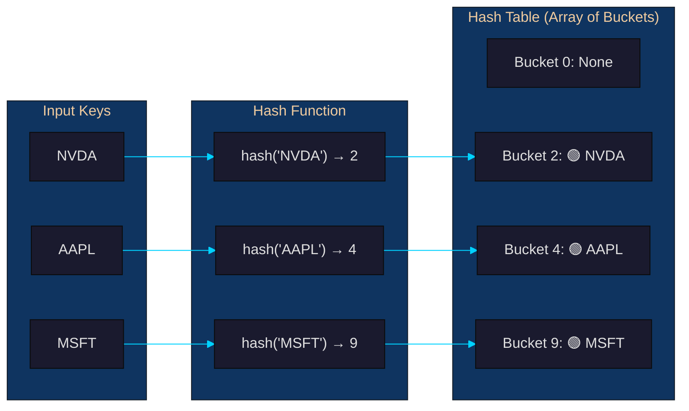
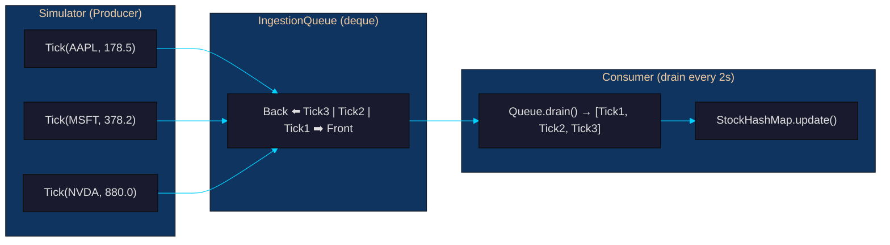
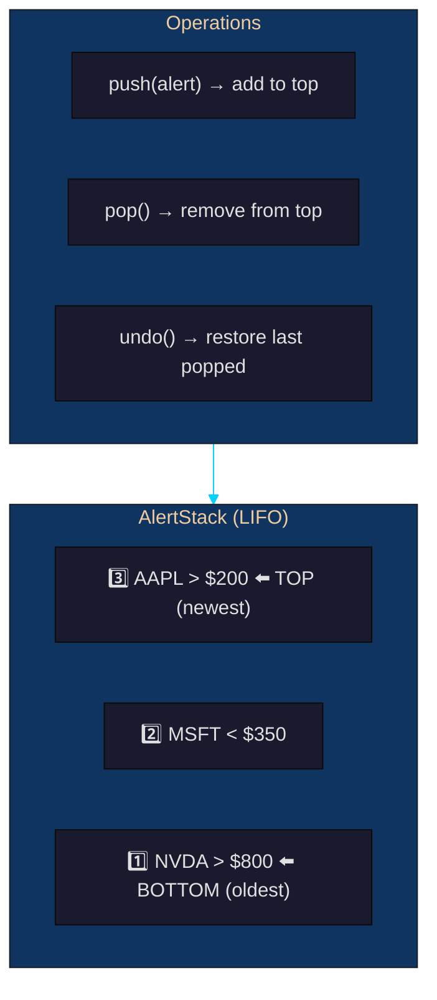
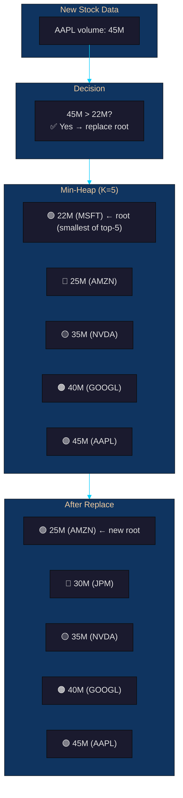
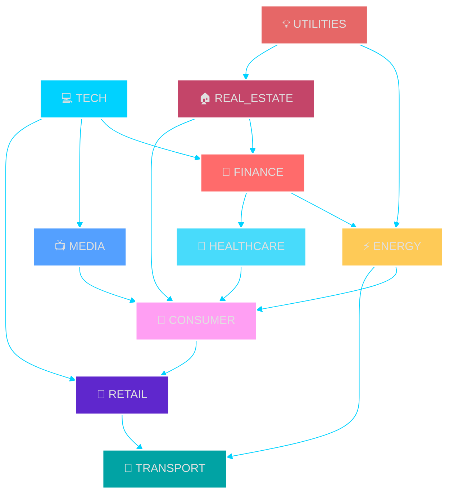
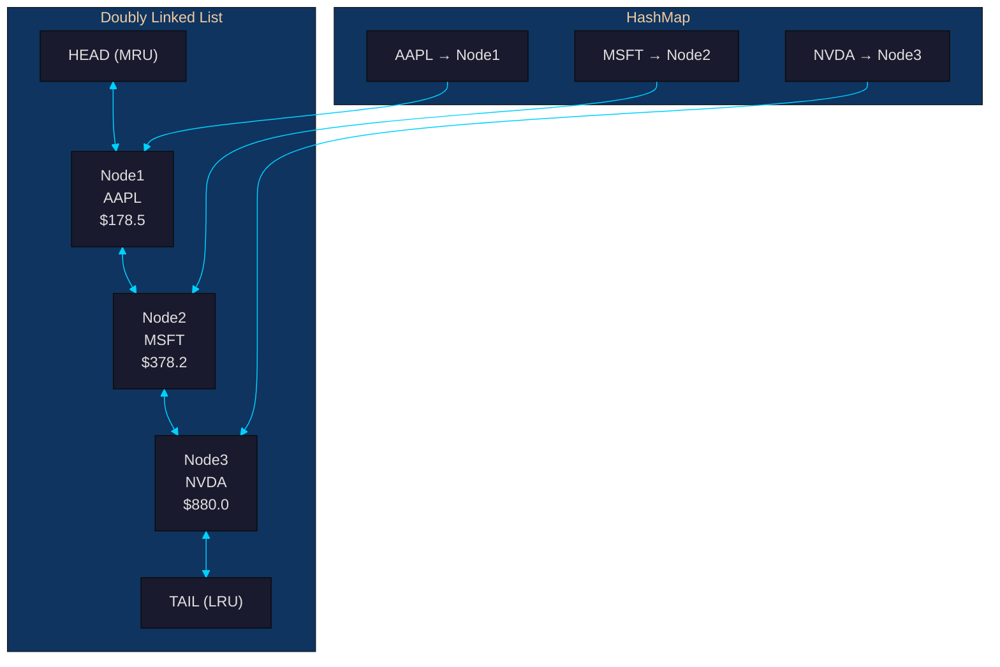
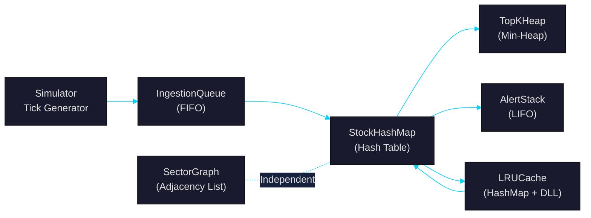

# Person 2 — Data Structures Lead

## Your Role
You implement **7 data structures** that form the core DSA engine. Every API endpoint relies on your code. You must understand each structure's problem, algorithm, complexity, and how it connects to the others.

---

## Your Files

| File | Structure |
|------|-----------|
| `backend/structures/stock_map.py` | **StockHashMap** — hash table |
| `backend/structures/ingestion_queue.py` | **IngestionQueue** — FIFO queue |
| `backend/structures/alert_stack.py` | **AlertStack** — LIFO stack with undo |
| `backend/structures/top_k_heap.py` | **TopKHeap** — min-heap for top-K |
| `backend/structures/sector_graph.py` | **SectorGraph** — adjacency list graph |
| `backend/structures/lru_cache.py` | **LRUCache** — HashMap + Doubly Linked List |
| `backend/structures/__init__.py` | Package init |
| `backend/__init__.py` | Package init |

---

## Structure 1: StockHashMap (Hash Table)

### Problem
Every API request needs to find a stock by its ticker symbol. A linear scan of 10,000 stocks takes ~10ms per request. With hundreds of concurrent requests, that becomes a bottleneck.

### Solution
A **hash map** stores key-value pairs where the **key** (symbol like "AAPL") is hashed to a bucket index, giving **O(1) average** lookup.

### How It Works

```text
    Key "AAPL" ──▶ hash("AAPL") ──▶ index = hash % table_size ──▶ StockRecord{price: 178.5, ...}
```



### Example from Code

```python
hm = StockHashMap()
r = StockRecord("AAPL", 178.50, 45_000_000, "TECH")
hm.put("AAPL", r)

# Later — O(1) lookup
record = hm.get("AAPL")        # Returns the record instantly
record = hm.get("aapl")        # Also works — case-insensitive
record = hm.get("NOTHING")     # Returns None
```

### Complexity

| Operation | Time | Space |
|-----------|------|-------|
| `put(symbol, record)` | O(1) avg, O(n) worst (resize) | O(1) |
| `get(symbol)` | O(1) avg | O(1) |
| `update(symbol, price, vol)` | O(1) avg | O(1) |
| `remove(symbol)` | O(1) avg | O(1) |
| `contains(symbol)` | O(1) avg | O(1) |
| `all_records()` | O(n) | O(n) |

### Edge Cases
- **Missing key** — `get("ZZZ")` returns None, doesn't crash
- **Case sensitivity** — "aapl", "AAPL", "Aapl" all resolve to same entry
- **Empty map** — `size()` returns 0, `get()` returns None
- **Duplicate key** — `put()` overwrites old value silently

---

## Structure 2: IngestionQueue (Queue / FIFO)

### Problem
The market simulator generates price ticks every 2 seconds. These ticks must be **processed in the exact order they arrive** — the price at 10:00:01 must be applied before 10:00:03. A queue guarantees FIFO (First-In, First-Out) ordering.

### Solution
A **queue** backed by `collections.deque` (double-ended queue). Ticks enter at the back and leave from the front — both O(1) operations.

### How It Works



### Example from Code

```python
q = IngestionQueue()
tick = Tick("AAPL", 178.50, 45_000_000, datetime.now())
q.enqueue(tick)           # O(1) — add to back

# Later — drain all at once
batch = q.drain()         # O(n) — returns all ticks, clears queue
for t in batch:
    stock_map.update(t.symbol, t.price, t.volume)
```

### Why `deque` and not a `list`?
A Python list's `pop(0)` shifts all remaining elements left — **O(n)**. `deque.popleft()` uses a doubly-linked list of fixed-size blocks — **O(1)**.

### Complexity

| Operation | Time | Space |
|-----------|------|-------|
| `enqueue(tick)` | O(1) amortised | O(1) |
| `dequeue()` | O(1) amortised | O(1) |
| `drain()` | O(n) | O(n) |
| `peek()` | O(1) | O(1) |
| `size()` | O(1) | O(1) |

### Edge Cases
- **Empty queue** — `dequeue()` raises `IndexError`, `peek()` returns None
- **Rapid enqueue** — deque handles dynamic resizing internally
- **Burst drain** — drain captures all pending ticks atomically

---

## Structure 3: AlertStack (Stack / LIFO)

### Problem
Analysts set price alerts — "notify me when AAPL goes above $200". Alerts are reviewed in **reverse creation order**: the newest alert is the first to check or dismiss. This is LIFO (Last-In, First-Out). Users also expect to **undo** their last accidental deletion.

### Solution
A **stack** (Python list) stores alerts. `append()` and `pop()` are both O(1). A secondary **undo buffer** stores the most recently popped alert so it can be restored.

### How It Works



### Example from Code

```python
alerts = AlertStack()

# Push alerts (newest on top)
alerts.push(Alert("AAPL", 200, "above", "Profit target"))
alerts.push(Alert("MSFT", 350, "below", "Stop loss"))
alerts.push(Alert("NVDA", 800, "above", "Breakout"))

top = alerts.peek()    # Returns NVDA alert (top of stack)

popped = alerts.pop()   # Removes NVDA, saves to undo buffer
alerts.undo()           # NVDA is restored to top of stack
```

### Complexity

| Operation | Time | Space |
|-----------|------|-------|
| `push(alert)` | O(1) | O(1) |
| `pop()` | O(1) | O(1) |
| `peek()` | O(1) | O(1) |
| `undo()` | O(1) | O(1) |
| `all_alerts()` | O(n) | O(n) |

### Constraints
- **MAX_SIZE = 1,000** alerts. `push()` raises `ValueError` if full.
- **Single-level undo** — a new push clears the undo buffer.

### Edge Cases
- **Empty stack** — `pop()` raises `IndexError`, `peek()` returns None
- **Undo with nothing to undo** — returns False gracefully
- **Full stack** — push raises `ValueError` with message

---

## Structure 4: TopKHeap (Min-Heap)

### Problem
The dashboard needs "top 5 stocks by volume" on every page load. Sorting all 10,000 stocks is O(N log N) per request. A **size-bounded min-heap** maintains the top-K candidates incrementally at O(log K) per update.

### Solution
A **min-heap** of exactly K items. The **root** is the **smallest** value in the top-K. When a new value arrives:
- If heap has < K items → push unconditionally
- If new value > root → replace root, sift down
- If new value ≤ root → discard



### Example from Code

```python
heap = TopKHeap(k=10)

# Push all stocks — heap keeps only top 10
for symbol, volume in stock_data:
    heap.push(symbol, volume)     # O(log K) each

# Get top 10 sorted descending
top_10 = heap.top_k()             # Returns [(45M, AAPL), (40M, GOOGL), ...]
```

### Complexity

| Operation | Time | Space |
|-----------|------|-------|
| `push(symbol, value)` | O(log K) | O(1) |
| `top_k()` | O(K log K) | O(K) |
| `peek_min()` | O(1) | O(1) |
| `heapify_all(items)` | O(N log K) | O(K) |

### Constraints
- K is configurable (default 10), max recommended 100
- Unique symbol tracking via `_symbols` dict prevents duplicates
- `_remove_entry` does an O(K) linear scan (acceptable for K ≤ 100)

### Edge Cases
- **Empty heap** — `peek_min()` returns None, `top_k()` returns []
- **Duplicate symbols** — replaces old entry instead of duplicating
- **K=1** — works as a simple max-tracker

---

## Structure 5: SectorGraph (Graph — Adjacency List)

### Problem
Stock sectors influence each other (TECH → FINANCE → ENERGY). We need to answer:
- **BFS:** "Which sectors are closest to TECH?" (shortest influence path)
- **DFS:** "If TECH moves, what's the full chain of sectors eventually affected?"

### Solution
A **directed adjacency list graph**. Each sector is a node, each influence relationship is a directed edge.

### How It Works



### BFS Example

```python
graph = SectorGraph()

# Add edges for sector influence
graph.add_edge("TECH", "FINANCE")
graph.add_edge("TECH", "MEDIA")
graph.add_edge("FINANCE", "ENERGY")

# BFS — nearest sectors first
result = graph.bfs("TECH")
# Returns: ["TECH", "FINANCE", "MEDIA", "ENERGY"]
```

BFS uses a deque as the frontier queue. It visits nodes **level by level** — sectors directly influenced by TECH come before indirectly influenced ones.

### DFS Example

```python
# DFS — full chain of influence
result = graph.dfs("TECH")
# Returns: ["TECH", "FINANCE", "ENERGY", "MEDIA"]
```

DFS explores **one path completely** before backtracking. It uses recursion (or an explicit stack for large graphs via `dfs_iterative`).

### Why Adjacency List?
Our graph has ~50 nodes and ~200 edges — **very sparse**. An adjacency matrix would waste 2,500 cells for 200 edges. An adjacency list uses exactly V + E memory.

### Complexity

| Operation | Time | Space |
|-----------|------|-------|
| `add_node(node)` | O(1) | O(1) |
| `add_edge(from, to)` | O(1) | O(1) |
| `bfs(start)` | O(V + E) | O(V) |
| `dfs(start)` | O(V + E) | O(V) |
| `dfs_iterative(start)` | O(V + E) | O(V) |

### Edge Cases
- **Start node not in graph** — returns `[]`
- **Disconnected graph** — only returns nodes reachable from start
- **Duplicate edges** — silently ignored
- **Large graphs (n > 1000)** — `dfs_iterative` avoids recursion limit

---

## Structure 6: LRUCache (HashMap + Doubly Linked List)

### Problem
80% of API requests hit 20% of stocks (Pareto principle). Without caching, every read hits the StockHashMap. An **LRU cache** keeps recently accessed stocks in memory and **evicts the Least Recently Used** entry when full.

### Solution
A **composite structure**: HashMap for O(1) key lookup + Doubly Linked List for O(1) "move to front" (mark as recently used).

### How It Works



### Example from Code

```python
cache = LRUCache(capacity=3)

# Add entries
cache.put("AAPL", stock_record1)     # AAPL at head (most recent)
cache.put("MSFT", stock_record2)     # MSFT at head, AAPL moves down
cache.put("NVDA", stock_record3)     # NVDA at head

# Access AAPL — moves it BACK to head
cache.get("AAPL")                    # Now: HEAD → AAPL → NVDA → MSFT → TAIL

# Add new entry — evicts MSFT (least recently used)
cache.put("GOOGL", stock_record4)    # Evicts MSFT
```

### Complexity

| Operation | Time | Space |
|-----------|------|-------|
| `get(key)` | O(1) | O(1) |
| `put(key, value)` | O(1) | O(1) |
| `remove(key)` | O(1) | O(1) |
| `contains(key)` | O(1) | O(1) |
| Space | — | O(capacity) |

### Edge Cases
- **Cache miss** — `get()` returns None, increments miss counter
- **Full cache** — `put()` evicts tail automatically
- **Update existing key** — updates value and moves to head
- **Empty cache** — `get()` returns None, `size()` returns 0

---

## How They Connect



The **data pipeline** is:
1. **Simulator** generates a price tick
2. **IngestionQueue** buffers the tick (FIFO)
3. **StockHashMap** stores/updates the stock record
4. **TopKHeap** updates the top-K ranking
5. **AlertStack** checks if any alerts should trigger
6. **LRUCache** sits in front of StockHashMap for hot stocks
7. **SectorGraph** is independent — used for exploration queries

---

## Your Git Commands

```bash
# Commit all your structures
git add backend/__init__.py backend/structures/
git commit -m "feat: implement 6 DSA structures — hash map, queue, stack, heap, graph, LRU cache"
git push origin main
```

To split into multiple commits (better for history):

```bash
git add backend/structures/__init__.py backend/structures/stock_map.py backend/__init__.py
git commit -m "feat: add StockHashMap — O(1) hash table for symbol lookup"

git add backend/structures/ingestion_queue.py
git commit -m "feat: add IngestionQueue — O(1) FIFO deque-backed tick buffer"

git add backend/structures/alert_stack.py
git commit -m "feat: add AlertStack — LIFO stack with single-level undo"

git add backend/structures/top_k_heap.py
git commit -m "feat: add TopKHeap — O(log K) min-heap for top-K ranking"

git add backend/structures/sector_graph.py
git commit -m "feat: add SectorGraph — adjacency-list graph with BFS/DFS"

git add backend/structures/lru_cache.py
git commit -m "feat: add LRUCache — HashMap + Doubly Linked List composite"

git push origin main
```
