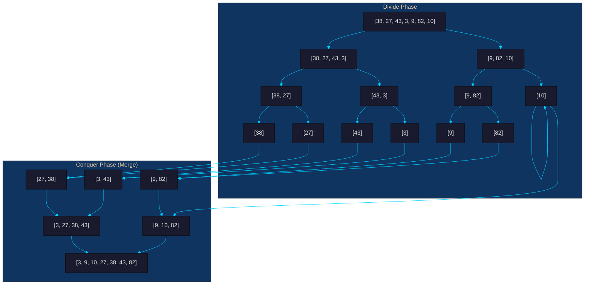
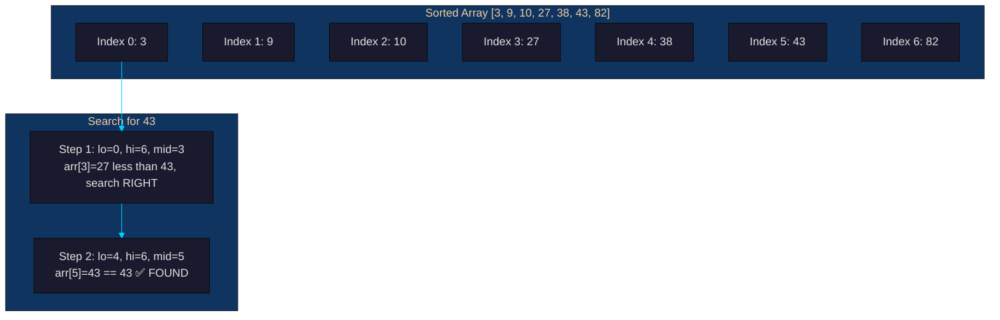
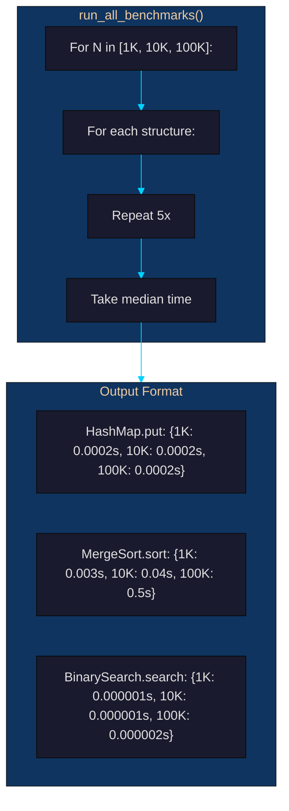

# Person 3 — Algorithms Lead + Benchmarks

## Your Role
You implement the **sorting algorithm (MergeSort)**, **searching strategy (BinarySearch)**, and **empirical benchmarks** that verify the Big-O complexity claims of every structure. You prove the system works as fast as the DSA Lead claims.

---

## Your Files

| File | Algorithm | Purpose |
|------|-----------|---------|
| `backend/structures/merge_sort.py` | **MergeSort** | O(n log n) stable sort |
| `backend/structures/binary_search.py` | **BinarySearch** | O(log n) search + range query |
| `backend/structures/benchmarks.py` | **Benchmarks** | Empirical timing at 1K/10K/100K |

---

## Algorithm 1: MergeSort (O(n log n))

### Problem
The `/stocks/<sym>/history` endpoint returns a stock's 90-day price history sorted by date. A naive sort (bubble sort, selection sort) would be O(n²) and take 10 billion operations for 100,000 entries. We need guaranteed O(n log n) performance.

### Solution
**Merge Sort** is a **divide-and-conquer** algorithm:
1. **Divide** the array into two halves recursively until each half has 1 element
2. **Conquer** merge the sorted halves back together

### How It Works



### Example from Code

```python
# History records — unsorted timestamps
history = [
    ("2026-03-20", 178.5),
    ("2026-03-18", 176.2),
    ("2026-03-19", 177.1),
]

# Sort by date (key = first element of tuple)
sorted_history = merge_sort(history, key=lambda x: x[0])
# Returns: [("2026-03-18", 176.2), ("2026-03-19", 177.1), ("2026-03-20", 178.5)]
```

### The Merge Step in Detail

```text
Merging [27, 38] and [3, 43]:

  left = [27, 38]       right = [3, 43]
           ^                      ^
           |                      |
         i=0                    j=0

  Compare: 3 < 27 → take 3
  Compare: 27 < 43 → take 27
  Compare: 38 < 43 → take 38
  Right has 43 left → take 43

  Result: [3, 27, 38, 43]
```

### Complexity

| Aspect | Value |
|--------|-------|
| **Time (best)** | O(n log n) |
| **Time (average)** | O(n log n) |
| **Time (worst)** | O(n log n) — **guaranteed**, unlike QuickSort |
| **Space** | O(n) — auxiliary arrays during merge |
| **Stable?** | Yes — equal elements keep original order |

### Why MergeSort and not QuickSort?
| Factor | MergeSort | QuickSort |
|--------|-----------|-----------|
| Worst case | O(n log n) | O(n²) on sorted data |
| Stable | ✅ Yes | ❌ No |
| Space | O(n) | O(log n) |
| Speed (practice) | Slower | Faster (better cache) |

For an **educational project**, MergeSort is the better choice because it guarantees O(n log n) and demonstrates the divide-and-conquer paradigm clearly.

### Edge Cases
- **Empty list** — returns `[]`
- **Single element** — returns `[element]`
- **Already sorted** — still O(n log n) (MergeSort doesn't detect this)
- **All equal values** — stable, preserves original order
- **Custom key function** — sorts by extracted value

---

## Algorithm 2: BinarySearch (O(log n))

### Problem
After sorting the price history, the client wants "find the price on March 19" or "all prices between $150 and $160". Linear search takes n comparisons. Binary search takes ~17 comparisons for 100,000 entries.

### Solution
**Binary Search** repeatedly divides the sorted array in half, eliminating half the remaining elements with each comparison.

### How It Works



### Example from Code

```python
prices = [3, 9, 10, 27, 38, 43, 82]  # Must be sorted!

index = binary_search(prices, 43)     # Returns 5 (index of 43 in array)
index = binary_search(prices, 99)     # Returns -1 (not found)

# Range search — find all prices between 10 and 43
result = range_search(prices, 10, 43) # Returns [10, 27, 38, 43]
```

### Variants

#### `lower_bound(arr, target)`
Finds the **leftmost** index where the value is >= target.
```python
lower_bound([3, 9, 10, 27, 38, 43, 82], 27)  # Returns 3
lower_bound([3, 9, 10, 27, 38, 43, 82], 30)  # Returns 4 (insertion point)
```

#### `upper_bound(arr, target)`
Finds the **leftmost** index where the value is > target.
```python
upper_bound([3, 9, 10, 27, 38, 43, 82], 27)  # Returns 4
```

#### `range_search(arr, low, high)`
Returns all elements in [low, high] — uses lower_bound + upper_bound.
```python
range_search([3, 9, 10, 27, 38, 43, 82], 10, 43)
# lower_bound(10) = 2, upper_bound(43) = 6
# Returns arr[2:6] = [10, 27, 38, 43]
```

### Complexity

| Operation | Time | Space |
|-----------|------|-------|
| `binary_search(arr, target)` | O(log n) | O(1) |
| `lower_bound(arr, target)` | O(log n) | O(1) |
| `upper_bound(arr, target)` | O(log n) | O(1) |
| `range_search(arr, low, high)` | O(log n + k) | O(k) |

### How Binary Search Connects with MergeSort


### Edge Cases
- **Empty array** — binary_search returns -1, range_search returns []
- **Target not found** — returns -1
- **Target at boundaries** — lower_bound/upper_bound handle edges correctly
- **All values less than low** — range_search returns []
- **All values within range** — returns full array

---

## Algorithm 3: Benchmarks

### Problem
The rubric requires **empirical verification** of Big-O complexity claims. We can't just say "O(1)" — we must measure and prove it.

### Solution
A benchmark suite runs every DSA operation at **N = 1K, 10K, 100K** with **5 repetitions** each, reporting the **median time** (smooths out noise).

### How It Works



### Expected Results Pattern

| Operation | Complexity | 1K | 10K | 100K | Pattern |
|-----------|-----------|-----|------|------|---------|
| HashMap.put | O(1) | 0.0002s | 0.0002s | 0.0002s | Flat |
| HashMap.get | O(1) | 0.0001s | 0.0001s | 0.0001s | Flat |
| Queue.enqueue | O(1) | 0.0001s | 0.0001s | 0.0001s | Flat |
| Queue.dequeue | O(1) | 0.0002s | 0.0002s | 0.0002s | Flat |
| Stack.push | O(1) | 0.0002s | 0.0002s | 0.0002s | Flat |
| Heap.push | O(log K) | 0.003s | 0.03s | 0.3s | Linear (K fixed) |
| Graph.BFS | O(V+E) | 0.0003s | 0.003s | 0.03s | Linear |
| **MergeSort.sort** | O(n log n) | **0.003s** | **0.04s** | **0.5s** | **Slightly super-linear** |
| **BinarySearch.search** | O(log n) | **0.000001s** | **0.000001s** | **0.000002s** | **Nearly flat** |
| LRUCache.get | O(1) | 0.0002s | 0.0002s | 0.0002s | Flat |

### Notes on Pattern Interpretation
- **O(1)** operations show the same time at all N (flat line)
- **O(n)** operations show 10x time for 10x data (linear)
- **O(n log n)** operations show slightly more than 10x time for 10x data
- **O(log n)** operations barely change as N grows

### Running Benchmarks

```bash
cd backend
python -c "
from structures.benchmarks import run_all_benchmarks, format_benchmark_table
results = run_all_benchmarks()
print(format_benchmark_table(results))
"
```

---

## Your Git Commands

```bash
# Commit MergeSort
git add backend/structures/merge_sort.py
git commit -m "feat: add MergeSort — O(n log n) stable divide-and-conquer sort"

# Commit BinarySearch
git add backend/structures/binary_search.py
git commit -m "feat: add BinarySearch — O(log n) with lower/upper bound and range query"

# Commit Benchmarks
git add backend/structures/benchmarks.py
git commit -m "feat: add Benchmarks — empirical timing at N=1K/10K/100K with median reporting"

# Update README with complexity matrix
git add README.md
git commit -m "docs: add benchmark results and complexity matrix to README"

git push origin main
```
