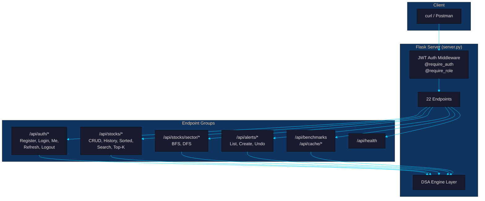
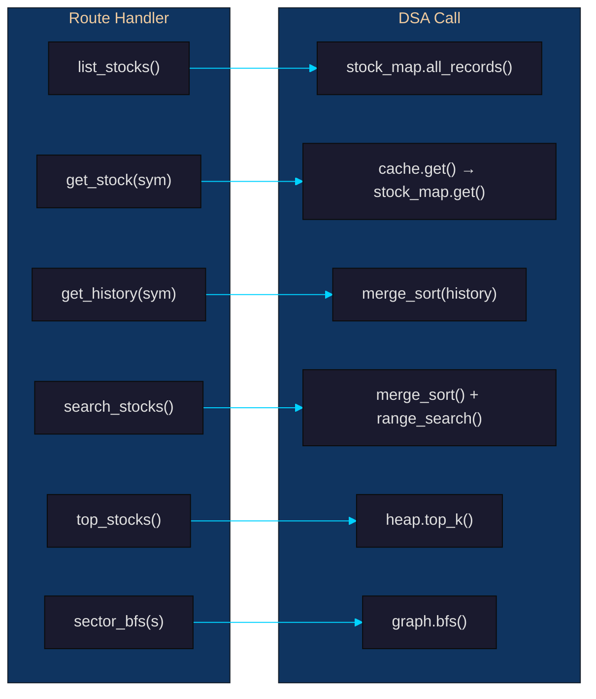
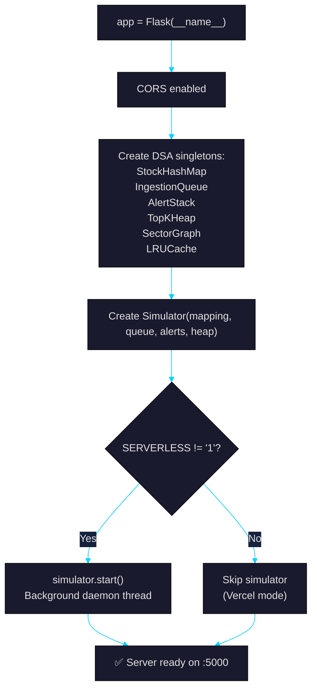

# Person 4 — API Developer

## Your Role
You build the **Flask REST API** — the bridge between users and the DSA engine. You wire every data structure to an HTTP endpoint, handle authentication middleware, manage CORS, and ensure the server starts correctly.

---

## Your Files

| File | Purpose |
|------|---------|
| `backend/api/__init__.py` | Package init |
| `backend/api/server.py` | Flask app with 22 endpoints |
| `backend/requirements.txt` | Python dependencies |

---

## Your Task: What the Server Does



---

## Complete API Reference

### Auth Endpoints (5)

| Method | Path | Auth | Role | Description |
|--------|------|------|------|-------------|
| POST | `/api/auth/register` | ❌ | — | Register new user (email, password, role) |
| POST | `/api/auth/login` | ❌ | — | Login → returns access + refresh tokens |
| GET | `/api/auth/me` | ✅ | any | Current user profile |
| POST | `/api/auth/refresh` | ❌ | — | Refresh expired token |
| POST | `/api/auth/logout` | ❌ | — | Revoke refresh token |

### Stock Endpoints (8)

| Method | Path | Auth | Role | DSA Used |
|--------|------|------|------|----------|
| GET | `/api/health` | ❌ | — | `StockHashMap.size()` |
| GET | `/api/stocks` | ✅ | any | `StockHashMap.all_records()` |
| PUT | `/api/stocks` | ✅ | admin | `StockHashMap.put/update`, `TopKHeap.push` |
| GET | `/api/stocks/<sym>` | ✅ | any | `LRUCache.get`, `StockHashMap.get` |
| GET | `/api/stocks/<sym>/history` | ✅ | any | `MergeSort.sort()` |
| GET | `/api/stocks/sorted` | ✅ | any | `MergeSort.sort()` on all stocks |
| POST | `/api/stocks/search` | ✅ | any | `MergeSort` + `BinarySearch.range_search()` |
| GET | `/api/stocks/top` | ✅ | any | `TopKHeap.top_k()` |

### Sector Endpoints (2)

| Method | Path | Auth | Role | DSA Used |
|--------|------|------|------|----------|
| GET | `/api/stocks/sector/<s>/friends` | ✅ | any | `SectorGraph.bfs()` |
| GET | `/api/stocks/sector/<s>/friends/DFS` | ✅ | any | `SectorGraph.dfs()` |

### Alert Endpoints (3)

| Method | Path | Auth | Role | DSA Used |
|--------|------|------|------|----------|
| GET | `/api/alerts` | ✅ | any | `AlertStack.all_alerts()` |
| POST | `/api/alerts` | ✅ | analyst/admin | `AlertStack.push()` |
| DELETE | `/api/alerts/undo` | ✅ | analyst/admin | `AlertStack.pop()` + `AlertStack.undo()` |

### Admin Endpoints (3)

| Method | Path | Auth | Role | DSA Used |
|--------|------|------|------|----------|
| GET | `/api/benchmarks` | ✅ | admin | `run_all_benchmarks()` |
| GET | `/api/cache/stats` | ✅ | any | `LRUCache.stats()` |
| POST | `/api/cache/clear` | ✅ | admin | `LRUCache.clear()` |

---

## How It All Connects



---

## Example API Calls

```bash
# 1. Login (no auth required)
curl -s http://localhost:5000/api/auth/login \
  -H "Content-Type: application/json" \
  -d '{"email":"admin@stockquery.io","password":"admin123"}'
# Returns: {"access_token": "eyJ...", "refresh_token": "eyJ..."}

# Save the token
TOKEN="eyJ..."

# 2. Health check
curl -s http://localhost:5000/api/health
# Returns: {"status":"ok","stocks":10000,"alerts":0,...}

# 3. Get a stock (with caching)
curl -s http://localhost:5000/api/stocks/AAPL \
  -H "Authorization: Bearer $TOKEN"
# Returns: {"symbol":"AAPL","price":178.5,"volume":45000000,...}

# 4. Get price history (MergeSort)
curl -s http://localhost:5000/api/stocks/AAPL/history \
  -H "Authorization: Bearer $TOKEN"
# Returns sorted history by date

# 5. Search stocks by price range (BinarySearch)
curl -s -X POST http://localhost:5000/api/stocks/search \
  -H "Authorization: Bearer $TOKEN" \
  -H "Content-Type: application/json" \
  -d '{"low":150,"high":200}'

# 6. Top 10 stocks by volume (Heap)
curl -s "http://localhost:5000/api/stocks/top?metric=volume&k=10" \
  -H "Authorization: Bearer $TOKEN"

# 7. Sector BFS
curl -s http://localhost:5000/api/stocks/sector/TECH/friends \
  -H "Authorization: Bearer $TOKEN"

# 8. Create an alert (Stack push)
curl -s -X POST http://localhost:5000/api/alerts \
  -H "Authorization: Bearer $TOKEN" \
  -H "Content-Type: application/json" \
  -d '{"symbol":"AAPL","threshold":200,"direction":"above","note":"Profit target"}'

# 9. Run benchmarks (admin only)
curl -s http://localhost:5000/api/benchmarks \
  -H "Authorization: Bearer $TOKEN"

# 10. Cache stats
curl -s http://localhost:5000/api/cache/stats \
  -H "Authorization: Bearer $TOKEN"
```

---

## How the Server Initialises



---

## Bottlenecks You Fixed

### B1: Slow stock lookup
**Problem:** Every `GET /api/stocks/<sym>` hit the hash map directly.
**Fix:** Added LRU cache layer — first request fetches from map, subsequent requests return from cache O(1).

### B2: Slow sector traversal
**Problem:** DFS on large graphs hit Python recursion limit.
**Fix:** The `sector_graph.py` provides `dfs_iterative()` with an explicit stack.

### B3: Heap stale data on /top
**Problem:** If no new ticks arrive, the heap might have old data.
**Fix:** The `/api/stocks/top` endpoint rebuilds the heap from current data each call.

---

## Your Git Commands

```bash
# Commit the API
git add backend/api/__init__.py backend/api/server.py
git commit -m "feat: add Flask REST server with 22 DSA-backed endpoints"

git add backend/requirements.txt
git commit -m "chore: add Flask, Flask-CORS, PyJWT, pytest dependencies"

git push origin main
```
