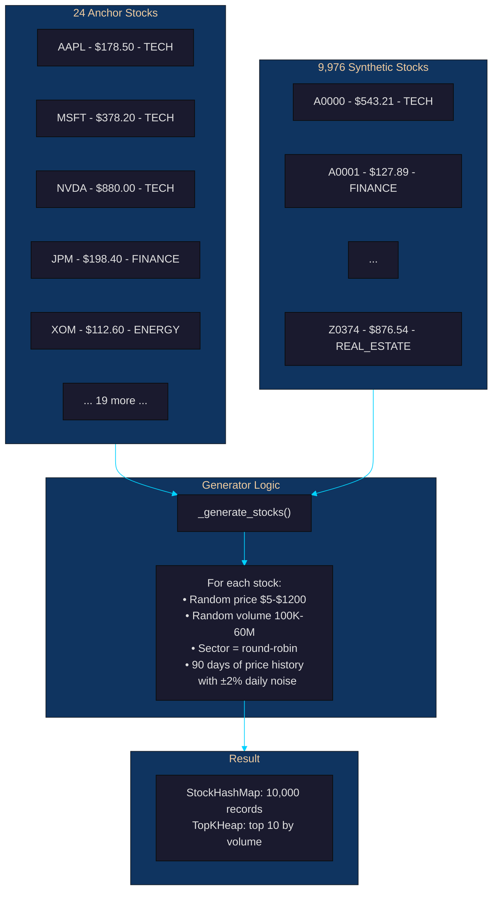
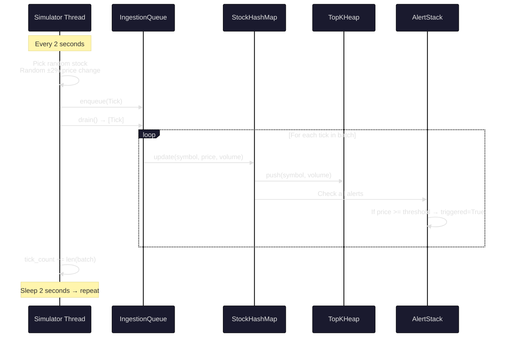

# Person 5 — Auth + Simulator Developer

## Your Role
You build two critical systems:
1. **JWT Authentication** — secures every API endpoint with role-based access control
2. **Market Simulator** — generates 10,000 stocks with realistic price history and live ticks

---

## Your Files

| File | Purpose |
|------|---------|
| `backend/api/auth.py` | JWT auth, RBAC decorators, 3 demo accounts, register/login/refresh/logout |
| `backend/api/simulator.py` | Background daemon thread — seeds 10K stocks, generates ±2% ticks every 2s |
| `api/index.py` | Vercel serverless entry point |

---

## Part 1: JWT Authentication (`auth.py`)

### Problem
The API needs to be secure. Different users have different permissions:
- **admin** — can create/update stocks, run benchmarks, clear cache
- **analyst** — can create alerts
- **viewer** — can only read data

### Solution
**JWT (JSON Web Tokens)** with **RBAC (Role-Based Access Control)**.

```mermaid
%%{init: {'theme': 'base', 'themeVariables': { 'primaryColor': '#1a1a2e', 'primaryTextColor': '#e0e0e0', 'lineColor': '#00d2ff', 'secondaryColor': '#16213e', 'tertiaryColor': '#0f3460'}}}%%
sequenceDiagram
    participant C as Client
    participant S as Flask Server
    participant A as Auth Module
    
    C->>S: POST /api/auth/login<br/>{email, password}
    S->>A: handle_login(data)
    A->>A: Hash password<br/>Lookup user<br/>Check credentials
    A-->>S: {access_token, refresh_token, role}
    S-->>C: ✅ Tokens issued
    
    C->>S: GET /api/stocks/AAPL<br/>Authorization: Bearer &lt;token&gt;
    S->>A: @require_auth → decode JWT
    A-->>S: {email, role}
    S->>S: Process request
    S-->>C: ✅ Stock data
    
    Note over C,S: When access_token expires (1h)
    C->>S: POST /api/auth/refresh<br/>{refresh_token}
    S->>A: Verify refresh token
    A-->>S: New {access_token, refresh_token}
    S-->>C: ✅ New tokens
```

### How JWT Works

```text
TOKEN STRUCTURE:
  Header:    {"alg": "HS256", "typ": "JWT"}
  Payload:   {"email": "admin@stockquery.io", "role": "admin", "exp": 1712345678}
  Signature: HMAC-SHA256(base64(header) + "." + base64(payload), SECRET_KEY)

  The three parts are base64-encoded and joined with dots:
  eyJhbGci... . eyJlbWFpbCI... . sQjd8s9d...
```

### 3 Demo Accounts

| Email | Password | Role | Can Do |
|-------|----------|------|--------|
| admin@stockquery.io | admin123 | **admin** | Everything — CRUD stocks, benchmarks, cache, alerts |
| analyst@stockquery.io | analyst123 | **analyst** | Create/undo alerts, read stocks |
| viewer@stockquery.io | viewer123 | **viewer** | Read-only — stocks, history, search, top-k, sectors |

### Auth Decorators

```python
# Require any valid JWT
@require_auth
def get_stock(sym):
    # g.email and g.role are available
    pass

# Require specific role(s)
@require_role("admin")
def benchmarks():
    pass

@require_role("analyst", "admin")  # multiple allowed
def create_alert():
    pass
```

### Example Auth Flow

```bash
# 1. Login as admin
curl -s -X POST http://localhost:5000/api/auth/login \
  -H "Content-Type: application/json" \
  -d '{"email":"admin@stockquery.io","password":"admin123"}' | json_pp

# Response:
# {
#   "access_token": "eyJhbGciOiJIUzI1NiIs...",
#   "refresh_token": "eyJhbGciOiJIUzI1NiIs...",
#   "role": "admin",
#   "email": "admin@stockquery.io"
# }

# 2. Use token to access protected endpoints
TOKEN="eyJhbGciOiJIUzI1NiIs..."

curl -s http://localhost:5000/api/stocks/AAPL \
  -H "Authorization: Bearer $TOKEN"

# 3. Viewer cannot create alerts
VIEWER_TOKEN="eyJhbGciOi..."

curl -s -X POST http://localhost:5000/api/alerts \
  -H "Authorization: Bearer $VIEWER_TOKEN" \
  -H "Content-Type: application/json" \
  -d '{"symbol":"AAPL","threshold":200,"direction":"above"}'
# Response: 403 Forbidden — viewer role not authorized
```

### Password Security

```python
# SHA-256 hashing (not plaintext!)
def _hash_pw(password: str) -> str:
    return hashlib.sha256(password.encode()).hexdigest()

# Stored in memory: {"password_hash": "5e884898da280471...", "role": "admin"}
```

### Token Configuration

| Setting | Value | Purpose |
|---------|-------|---------|
| `ACCESS_EXPIRY` | 3600s (1 hour) | Short-lived — limits damage if stolen |
| `REFRESH_EXPIRY` | 604800s (7 days) | Long-lived — convenience, can be revoked |

---

## Part 2: Market Simulator (`simulator.py`)

### Problem
The system needs 10,000 stocks to demonstrate scalability. Manually creating them in tests isn't realistic. We need an automated **seeder** that generates synthetic market data and a **tick generator** that simulates live price movements.

### Solution
A **background daemon thread** that:
1. **Seeds** 24 well-known stocks (AAPL, MSFT, NVDA...) + 9,976 synthetic symbols
2. **Generates** ±2% price ticks every 2 seconds
3. **Updates** the IngestionQueue → StockHashMap → TopKHeap → AlertStack pipeline

### How the 10,000 Stocks are Generated



### Synthetic Symbol Scheme

```text
Stock #1   → A0000
Stock #2   → A0001
...
Stock #26  → A0025
Stock #27  → B0000
...
Stock #10000 → Z0374

Pattern: [A-Z][0-9]{4}
26 letters × 384 symbols each ≈ 10,000
```

### Tick Lifecycle



### Code Example — Tick Generation

```python
# In the simulator loop:
def _tick_cycle(self):
    # 1. Pick a random stock
    symbol = random.choice(self.stock_map.keys())
    record = self.stock_map.get(symbol)
    
    # 2. Generate ±2% price change
    change_pct = random.uniform(-0.02, 0.02)
    new_price = round(record.price * (1 + change_pct), 2)
    volume_delta = random.randint(-500_000, 500_000)
    new_volume = max(record.volume + volume_delta, 1_000)
    
    # 3. Enqueue the tick
    tick = Tick(symbol, new_price, new_volume, datetime.now())
    self.queue.enqueue(tick)
    
    # 4. Drain and process
    batch = self.queue.drain()
    for t in batch:
        self.stock_map.update(t.symbol, t.price, t.volume)
        self.heap.push(t.symbol, t.volume)
        # Check alerts...
```

### Sector Distribution

| Sector | Stocks | Examples |
|--------|--------|----------|
| TECH | ~1,000 | AAPL, MSFT, NVDA, GOOGL |
| FINANCE | ~1,000 | JPM, GS, V, BAC |
| ENERGY | ~1,000 | XOM, CVX, COP, SLB |
| HEALTHCARE | ~1,000 | JNJ, PFE, UNH, ABBV |
| CONSUMER | ~1,000 | AMZN, WMT, KO, PG |
| MEDIA | ~1,000 | META, DIS, NFLX, CMCSA |
| RETAIL | ~1,000 | (synthetic) |
| TRANSPORT | ~1,000 | (synthetic) |
| UTILITIES | ~1,000 | (synthetic) |
| REAL_ESTATE | ~1,000 | (synthetic) |

---

## Part 3: Vercel Serverless (`api/index.py`)

### Problem
The Flask server is designed for long-running processes. Vercel serverless functions have a timeout. We need an adapter.

### Solution
A thin entry point that imports the Flask app. The simulator is skipped when `SERVERLESS=1`:

```python
import os
os.environ["SERVERLESS"] = "1"

from backend.api.server import app

# Vercel looks for a variable named "app"
```

### How SERVERLESS Detection Works

```python
# In server.py:
if os.environ.get("SERVERLESS", "") != "1":
    app.simulator.start()
```

The condition `!= "1"` means:
- `SERVERLESS=1` → simulator is **skipped** (Vercel)
- `SERVERLESS=""` (or unset) → simulator **starts** (local dev)
- `SERVERLESS=0` → simulator **starts** (explicit local)

---

## Your Git Commands

```bash
# Commit auth module
git add backend/api/auth.py
git commit -m "feat: add JWT auth with RBAC — admin/analyst/viewer roles, 3 demo accounts"

# Commit simulator
git add backend/api/simulator.py
git commit -m "feat: add market simulator — seeds 10K stocks with 90-day history, live ticks"

# Commit Vercel entry
git add api/index.py
git commit -m "feat: add Vercel serverless entry point with SERVERLESS=1 flag"

git push origin main
```
