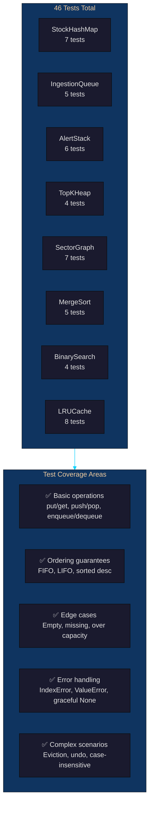

# Person 6 — Testing & QA Lead

## Your Role
You write **46 unit tests** covering all 9 data structures. You verify:
- **Correctness** — every operation returns the expected result
- **Edge cases** — empty structures, missing keys, full capacity, overflows
- **Ordering guarantees** — FIFO for queue, LIFO for stack, sorted for heap
- **Boundary conditions** — max size, recursion limits, negative values

---

## Your Files

| File | Purpose |
|------|---------|
| `backend/tests/__init__.py` | Package init (empty) |
| `backend/tests/test_engine.py` | 46 pytest tests across 8 test classes |

---

## Test Coverage Overview



---

## Test Details by Structure

### StockHashMap — 7 Tests

```python
class TestStockHashMap:
```

| Test | What It Checks | Why It Matters |
|------|----------------|----------------|
| `test_put_and_get` | Insert and retrieve a record | Basic O(1) read/write |
| `test_get_missing` | Returns None for unknown key | Prevents KeyError crashes |
| `test_update_existing` | Update price + volume on existing stock | Market tick updates |
| `test_update_missing` | Returns False for unknown symbol | Caller knows it failed |
| `test_remove` | Delete a symbol from map | Admin can remove delisted stocks |
| `test_remove_missing` | Returns False for unknown key | Graceful deletion |
| `test_case_insensitive` | "aapl", "AAPL", "Aapl" all match | User-friendly API |

**Example — testing case insensitivity:**
```python
def test_case_insensitive(self):
    hm = StockHashMap()
    hm.put("aapl", StockRecord("aapl", 150.0, 100000, "TECH"))
    assert hm.get("AAPL") is not None  # uppercase lookup
    assert hm.get("Aapl") is not None  # mixed case lookup
    assert hm.contains("AAPL")
```

---

### IngestionQueue — 5 Tests

```python
class TestIngestionQueue:
```

| Test | What It Checks | Why It Matters |
|------|----------------|----------------|
| `test_enqueue_dequeue` | Basic enqueue → dequeue | Core FIFO operation |
| `test_fifo_order` | First in = first out | Guarantees tick ordering |
| `test_dequeue_empty_raises` | IndexError on empty | No silent failures |
| `test_drain` | drain() returns all, queue is empty | Batch processing works |
| `test_peek` | peek shows front without removing | Can inspect without consuming |

**Example — testing FIFO ordering:**
```python
def test_fifo_order(self):
    q = IngestionQueue()
    q.enqueue(Tick("AAPL", 150.0, 1000, datetime.now()))
    q.enqueue(Tick("MSFT", 300.0, 2000, datetime.now()))
    assert q.dequeue().symbol == "AAPL"  # first in = first out
    assert q.dequeue().symbol == "MSFT"
```

---

### AlertStack — 6 Tests

```python
class TestAlertStack:
```

| Test | What It Checks | Why It Matters |
|------|----------------|----------------|
| `test_push_pop` | Basic push → pop | Core LIFO operation |
| `test_lifo_order` | Last in = first out | Alert review order |
| `test_pop_empty_raises` | IndexError on empty | No silent failures |
| `test_undo` | Undo restores popped alert | User error recovery |
| `test_undo_nothing` | Returns False when nothing to undo | Graceful call |
| `test_max_size` | Rejects push at capacity | Memory boundary |

**Example — testing LIFO + undo:**
```python
def test_lifo_order(self):
    s = AlertStack()
    s.push(Alert("A", 100, "above"))
    s.push(Alert("B", 200, "above"))
    s.push(Alert("C", 300, "above"))
    assert s.pop().symbol == "C"  # last in = first out
    assert s.pop().symbol == "B"
    assert s.pop().symbol == "A"

def test_undo(self):
    s = AlertStack()
    s.push(Alert("AAPL", 200, "above"))
    s.push(Alert("MSFT", 300, "above"))
    s.pop()                       # removes MSFT
    assert s.undo() is True       # restores MSFT
    assert s.peek().symbol == "MSFT"
```

---

### TopKHeap — 4 Tests

```python
class TestTopKHeap:
```

| Test | What It Checks | Why It Matters |
|------|----------------|----------------|
| `test_top_k_returns_descending` | Top-K sorted high→low | Dashboard display order |
| `test_never_exceeds_k` | Size is bounded | Memory guarantee |
| `test_push_small_ignored` | Low values discarded | Correct ranking |
| `test_peek_min` | Root is the K-th largest | Internal consistency |

**Example — testing top-K correctness:**
```python
def test_top_k_returns_descending(self):
    h = TopKHeap(k=3)
    for val, sym in [(10, "A"), (30, "B"), (20, "C"), (5, "D"), (40, "E")]:
        h.push(sym, val)
    top = h.top_k()
    values = [v for v, _ in top]
    assert values == [40, 30, 20]  # only top 3, sorted desc
```

---

### SectorGraph — 7 Tests

```python
class TestSectorGraph:
```

| Test | What It Checks | Why It Matters |
|------|----------------|----------------|
| `test_add_node` | Add a sector node | Graph construction |
| `test_add_edge` | Add directed edge | Relationship modelling |
| `test_bfs` | BFS visits level by level | Shortest influence path |
| `test_dfs` | DFS visits depth-first | Full chain discovery |
| `test_dfs_iterative` | Iterative DFS works | Avoids recursion limit |
| `test_bfs_empty_start` | Returns [] for unknown start | Graceful handling |
| `test_dfs_empty_start` | Returns [] for unknown start | Graceful handling |

**Example — testing BFS order:**
```python
def test_bfs(self):
    g = SectorGraph()
    g.add_edge("A", "B")
    g.add_edge("A", "C")
    g.add_edge("B", "D")
    path = g.bfs("A")
    assert path[0] == "A"
    assert set(path[1:3]) == {"B", "C"}  # both direct neighbours
    assert path[-1] == "D"               # D is 2 hops away
```

---

### MergeSort — 5 Tests

```python
class TestMergeSort:
```

| Test | What It Checks | Why It Matters |
|------|----------------|----------------|
| `test_sort_numbers` | Basic sort correctness | Algorithm works |
| `test_already_sorted` | Handles sorted input | No unnecessary swaps |
| `test_reverse_sorted` | Handles worst case | O(n log n) guarantee |
| `test_empty_and_single` | Base cases | Recursion termination |
| `test_with_key` | Custom key function | Sorting by date or price |

**Example — testing stability + key:**
```python
def test_with_key(self):
    data = [(3, "c"), (1, "a"), (2, "b")]
    result = merge_sort(data, key=lambda x: x[0])
    assert result == [(1, "a"), (2, "b"), (3, "c")]
```

---

### BinarySearch — 4 Tests

```python
class TestBinarySearch:
```

| Test | What It Checks | Why It Matters |
|------|----------------|----------------|
| `test_find_existing` | Finds existing element | Core O(log n) search |
| `test_find_missing` | Returns -1 for missing | Not-found handling |
| `test_lower_bound` | Leftmost insertion point | Range query start |
| `test_upper_bound` | One past last occurrence | Range query end |

**Example — testing range search building blocks:**
```python
def test_lower_bound(self):
    arr = [1, 3, 5, 5, 5, 7, 9]
    assert lower_bound(arr, 5) == 2   # first 5 is at index 2
    assert lower_bound(arr, 6) == 5   # would insert at index 5

def test_upper_bound(self):
    arr = [1, 3, 5, 5, 5, 7, 9]
    assert upper_bound(arr, 5) == 5   # one past last 5
    assert upper_bound(arr, 10) == 7  # past end of array
```

---

### LRUCache — 8 Tests

```python
class TestLRUCache:
```

| Test | What It Checks | Why It Matters |
|------|----------------|----------------|
| `test_get_put` | Basic insert + retrieve | Core O(1) operation |
| `test_get_miss` | Returns None for missing | Cache miss handling |
| `test_eviction` | LRU entry is evicted | Correct eviction policy |
| `test_get_refreshes_lru` | Access moves to MRU | Recency tracking |
| `test_update_existing` | Update value, size unchanged | Hot stock price update |
| `test_remove` | Manual removal | Admin cache management |
| `test_clear` | Complete reset | Emergency clear |
| `test_stats` | Hit/miss counters | Performance monitoring |

**Example — testing LRU eviction:**
```python
def test_eviction(self):
    c = LRUCache(3)
    c.put("A", 1)
    c.put("B", 2)
    c.put("C", 3)
    c.put("D", 4)           # evicts A (least recently used)
    assert c.get("A") is None  # A was evicted
    assert c.get("D") == 4     # D is present

def test_get_refreshes_lru(self):
    c = LRUCache(3)
    c.put("A", 1)
    c.put("B", 2)
    c.put("C", 3)
    c.get("A")                # A is now most recently used
    c.put("D", 4)             # evicts B (was LRU)
    assert c.get("B") is None
    assert c.get("A") == 1
```

---

## Running the Tests

```bash
cd backend
pytest tests/test_engine.py -v
```

**Expected output:**
```
test_engine.py::TestStockHashMap::test_put_and_get PASSED
test_engine.py::TestStockHashMap::test_get_missing PASSED
test_engine.py::TestStockHashMap::test_update_existing PASSED
...
test_engine.py::TestLRUCache::test_stats PASSED

======================= 46 passed in 0.45s ========================
```

### Run with Coverage Report

```bash
cd backend
pip install pytest-cov
pytest tests/test_engine.py --cov=structures --cov-report=term-missing -v
```

---

## How Tests Map to the Rubric

| Rubric Requirement | Tests Covering It |
|-------------------|-------------------|
| Hash table (StockHashMap) | 7 tests — put, get, update, remove, case-insensitive |
| Queue (IngestionQueue) | 5 tests — enqueue, dequeue, FIFO, drain, peek |
| Stack (AlertStack) | 6 tests — push, pop, LIFO, undo, max size |
| Heap (TopKHeap) | 4 tests — top-K, bounded size, min peek |
| Graph (SectorGraph) | 7 tests — BFS, DFS, iterative, empty start |
| Merge Sort | 5 tests — numbers, reversed, empty, key |
| Binary Search | 4 tests — find, missing, lower/upper bound |
| LRU Cache | 8 tests — eviction, refresh, remove, clear, stats |

---

## Your Git Commands

```bash
# Commit test files
git add backend/tests/__init__.py backend/tests/test_engine.py
git commit -m "test: add 46 pytest tests covering all 9 DSA structures with edge cases"

git push origin main
```
