# ALL MERMAID DIAGRAMS — Stock Query Server
# Open this file in VS Code with Mermaid extension to render
# Screenshot each diagram separately

---

## DIAGRAM 1: USE CASE DIAGRAM (Coloured)

```mermaid
%%{init: {'fontSize': '16px', 'nodePadding': '20'}}%%
graph TB
    classDef viewer fill:#4CAF50,stroke:#2E7D32,stroke-width:3px,color:#fff,font-size:18px
    classDef analyst fill:#2196F3,stroke:#1565C0,stroke-width:3px,color:#fff,font-size:18px
    classDef admin fill:#FF9800,stroke:#E65100,stroke-width:3px,color:#fff,font-size:18px
    classDef sim fill:#9C27B0,stroke:#4A148C,stroke-width:3px,color:#fff,font-size:18px
    classDef uc fill:#E3F2FD,stroke:#1565C0,stroke-width:2px,color:#000,font-size:13px
    classDef ucSim fill:#F3E5F5,stroke:#4A148C,stroke-width:2px,color:#000,font-size:13px

    V["Viewer"]
    A["Analyst"]
    Ad["Admin"]
    S["Simulator"]

    UC1["UC1: Lookup Stock (O(1) HashMap)"]
    UC2["UC2: View Top-K (O(log K) Heap)"]
    UC3["UC3: Explore Sectors (BFS/DFS Graph)"]
    UC4["UC4: Sort History (O(n log n) MergeSort)"]
    UC5["UC5: Search Range (O(log n) BinarySearch)"]
    UC6["UC6: Login (JWT Auth)"]
    UC7["UC7: Create Alert (O(1) Stack)"]
    UC8["UC8: Undo Alert (O(1) Pop)"]
    UC9["UC9: Run Benchmarks"]
    UC10["UC10: Clear Cache"]
    UC11["UC11: Buffer Ticks (FIFO Queue)"]
    UC12["UC12: Seed 10K Stocks"]

    V --> UC1
    V --> UC2
    V --> UC3
    V --> UC4
    V --> UC5
    V --> UC6
    A --> UC7
    A --> UC8
    Ad --> UC9
    Ad --> UC10
    S --> UC11
    S --> UC12

    class V viewer
    class A analyst
    class Ad admin
    class S sim
    class UC1,UC2,UC3,UC4,UC5,UC6,UC7,UC8,UC9,UC10 uc
    class UC11,UC12 ucSim
```

---

## DIAGRAM 2: SYSTEM ARCHITECTURE

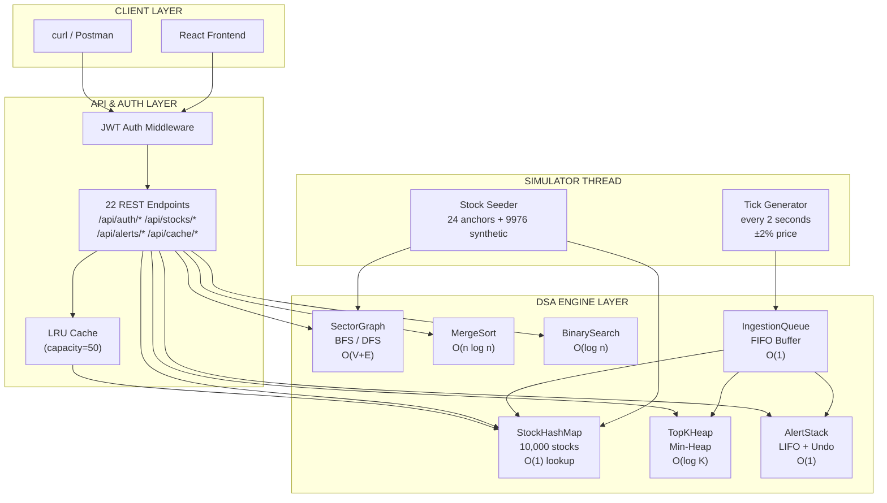

---

## DIAGRAM 3: DATA FLOW — WRITE PATH (Simulator Tick)

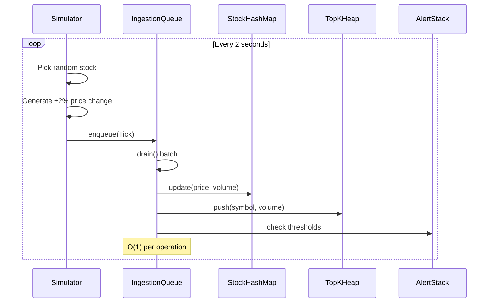

---

## DIAGRAM 4: DATA FLOW — READ PATH (Client Request)

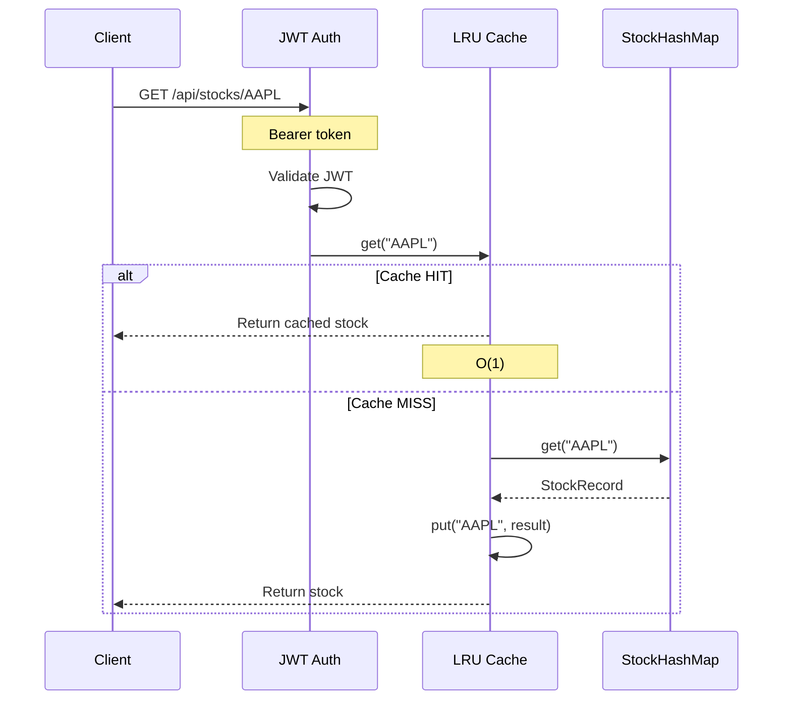

---

## DIAGRAM 5: CONSTRAINT → DSA DECISION TREE

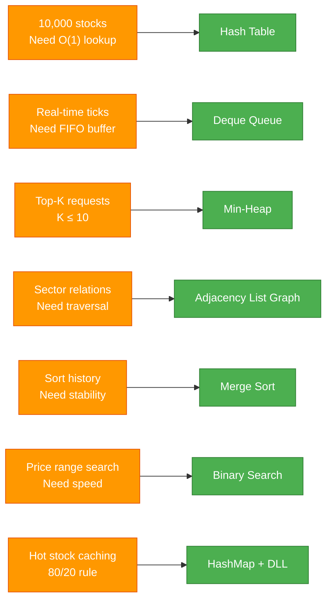

---

## DIAGRAM 6: BOTTLENECKS & FIXES

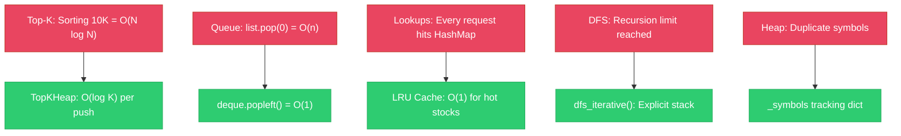

---

## DIAGRAM 7: MERGE SORT VISUALIZATION

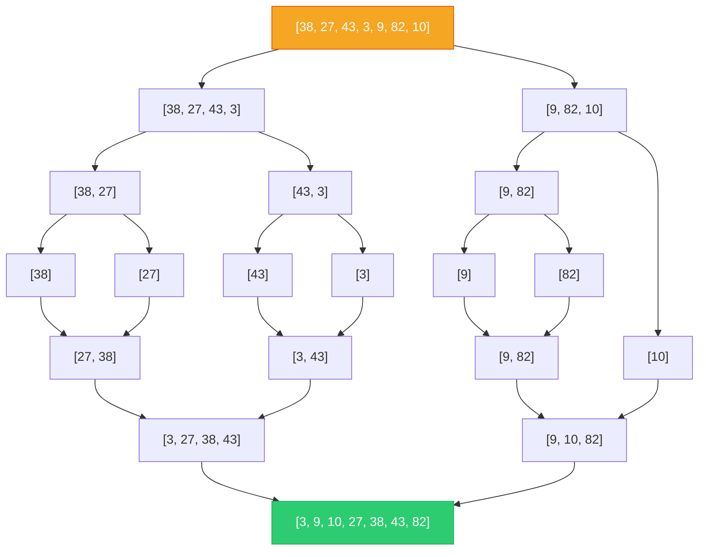

---

## DIAGRAM 8: TOPKHEAP VISUALIZATION (Min-Heap for Top-3)

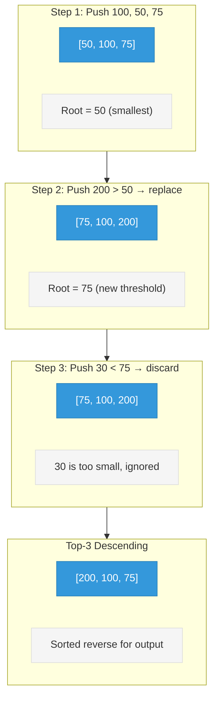

---

## DIAGRAM 9: LRU CACHE OPERATION

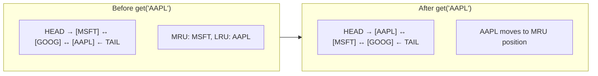

---

## DIAGRAM 10: SECTOR GRAPH BFS/DFS

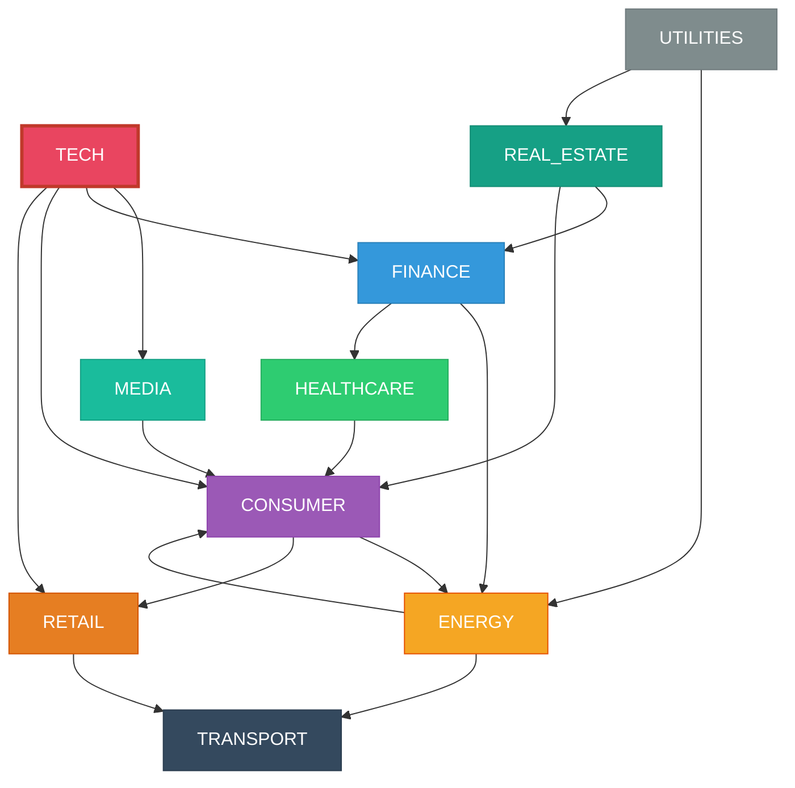

---

## DIAGRAM 11: JWT AUTH FLOW

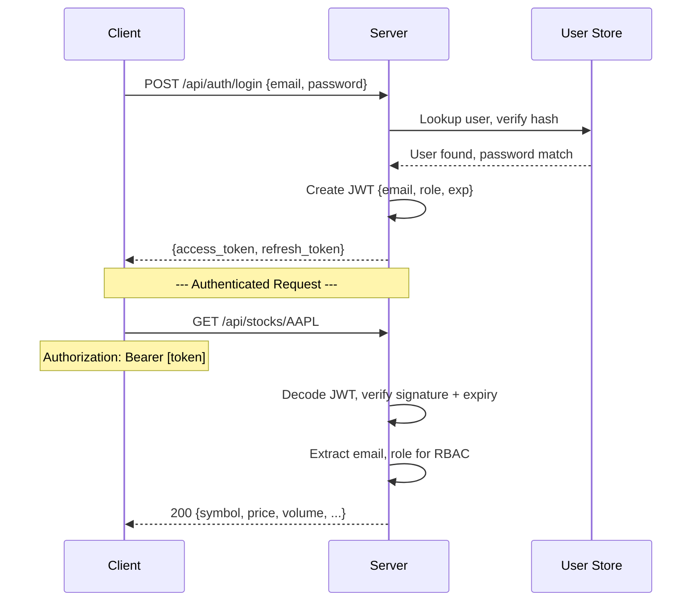

---

## DIAGRAM 12: BENCHMARK RESULTS VISUALIZATION

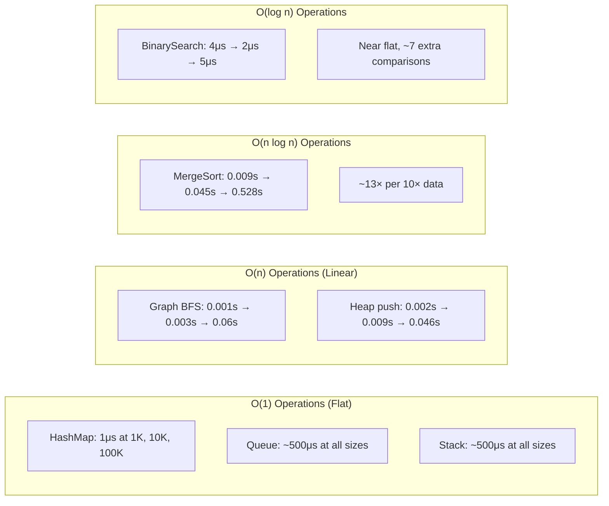

---

*End of Mermaid Diagrams — DSA-CH23-GROUP-01*
